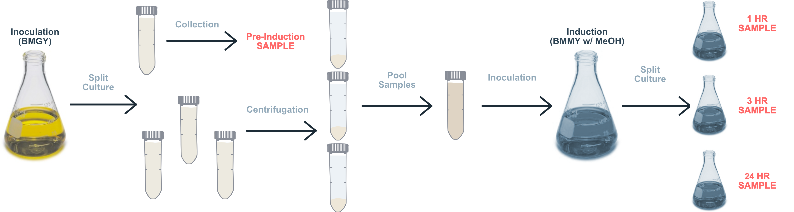
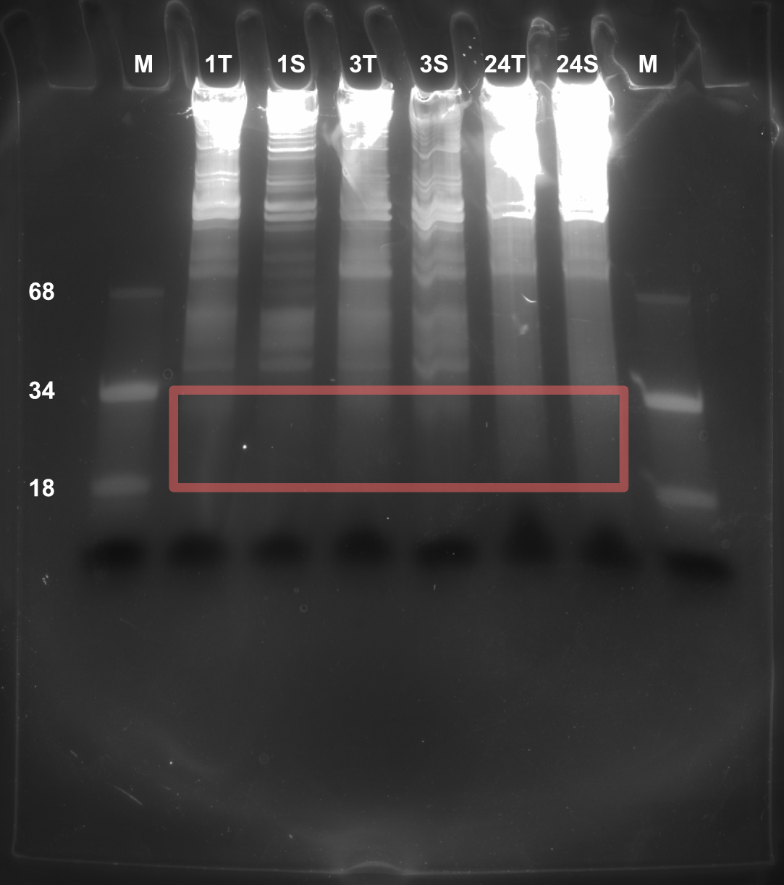

```{r options, message=FALSE, warning=FALSE, include=FALSE}

## Use cache for faster subsequent processing
knitr::opts_chunk$set(cache=TRUE)
opts <- options(knitr.kable.NA = "")

## Necessary libraries
library(data.table)
library(ggplot2)
library(cowplot)
library(magick)
library(scales)
library(plotly)
library(kableExtra)
library(dplyr)
library(zoo)

source("../processing/Revised/helperFunctions.R")

load("../data/pichia.dt.RData")
load("../data/yeast.dt.RData")

# Define colors
assign("black", "#000000", envir = .GlobalEnv)
assign("white", "#ffffff", envir = .GlobalEnv)
assign("grey", "#d3d6d9", envir = .GlobalEnv)
assign("orange", "#ff6666", envir = .GlobalEnv)
assign("blue", "#4a708b", envir = .GlobalEnv)
assign("lightblue1", "#809aad", envir = .GlobalEnv)
assign("lightblue2", "#a4b7c5", envir = .GlobalEnv)
assign("lightblue3", "#c8d4dc", envir = .GlobalEnv)
assign("lightblue4", "#ecf0f3", envir = .GlobalEnv)
assign("darkblue1", "#334e61", envir = .GlobalEnv)
assign("darkblue2", "#253845", envir = .GlobalEnv)
assign("darkblue3", "#162129", envir = .GlobalEnv)
assign("darkblue4", "#070b0d", envir = .GlobalEnv)

# Default theme
paper_theme <- theme_light(base_size = 10) + 
  theme(axis.text = element_text(size = rel(1.0), color = "black"),
        title = element_text(face = "bold"),
        axis.title = element_text(face = "bold"),
        plot.margin = margin(7,7,7,7), 
        panel.grid = element_blank())

# Wide tessellation theme
tess_top_theme <- theme_light(base_size = 10) + 
  theme(axis.text = element_text(size = rel(1.0), color = "black"),
        title = element_text(face = "bold"),
        axis.title = element_text(face = "bold"),
        plot.margin = margin(20,5,1,5),
        panel.grid = element_blank(), panel.border=element_blank())

# Narrow tessellation theme
tess_bottom_theme <- theme_light(base_size = 10) + 
  theme(axis.text = element_text(size = rel(1.0), color = "black"),
        title = element_text(face = "bold"),
        axis.title = element_text(face = "bold"),
        plot.margin = margin(1,5,20,5), 
        panel.grid = element_blank(), panel.border=element_blank())

# Enrichment vs TPM theme (top)
demands_top_theme <- paper_theme + theme(plot.margin = margin(7, 7, -5, 7),
                      axis.text.x = element_blank(),
                      panel.grid.major.x = element_line(size = rel(0.25), 
                                                        color = grey, 
                                                        linetype = "dashed"))
# Enrichment vs TPM theme (bottom)
demands_bottom_theme <- paper_theme + 
  theme(plot.margin = margin(0, 7, 7, 7), 
        panel.grid.major.x = element_line(size = rel(0.25),
                                          color = grey, 
                                          linetype = "dashed"))

# Min reads to plot
minimum <- 29

# Options for dot plot figures
dot.color = blue
contrast.color = orange
dot.size = 1
dot.shape = 20
line.size = 1

# Sets annotation size in plots to 6 font equivalent
annotation.size = 2.1166666666667

```


# Protein Biogenesis Demands of the Early Secretory Pathway during Heterologous Expression

## Previous findings

```{r nascentDemands, echo=FALSE, message=FALSE, warning=FALSE, fig.width=10}
# This figure plots enrichment score against TPM. It is meant to indicate how 
# many nascent chains will be entering endoplasmic reticulum. Visually, it shows
# that posttranslational targeting imposes a huge demand, but is restricted to 
# only a handful of proteins.

# Specify colors for secreted and membrane proteins
col.sec <- contrast.color 
col.mem <- dot.color 

### - - - - - - - - - - - - - - - - - - - - - - - - - - - - - - - - - - - - - -
### A) Sacharomyces cerevisiae
### - - - - - - - - - - - - - - - - - - - - - - - - - - - - - - - - - - - - - -

# Establish cerevisiae data sets
demands.sc.dt <- yeast.dt[dl.loc != "Mitochondrion" & 
                               s.chx.scaledReads > minimum &
                               m.chx.scaledReads > minimum & 
                               t.chx.scaledReads > minimum, 
                             .(id, gene, description, t.chx.ctpm, t.chx.rpm,
                               enrichment=es.chx.ms, sp.sp, tc.tm, length = protein.l)]
sc.sec.dt <- demands.sc.dt[sp.sp == TRUE & tc.tm <= 1]
sc.mem.dt <- demands.sc.dt[sp.sp == FALSE & tc.tm > 1]

### LEFT | Demand on translocatory system by numbers of nascent chains

# Establish NC data sets
sum.sc.secNC <- copy(sc.sec.dt)
setkey(sum.sc.secNC, enrichment)
sum.sc.secNC[, sum := cumsum(t.chx.ctpm)]
sum.sc.secNC[, norm.sum := sum/max(sum) * 100]

sum.sc.memNC <- copy(sc.mem.dt)
setkey(sum.sc.memNC, enrichment)
sum.sc.memNC[, sum := cumsum(t.chx.ctpm)]
sum.sc.memNC[, norm.sum := sum/max(sum) * 100]

# Top scatter plot for NC
scatter.scNC <- ggplot() +
  geom_point(data = sc.mem.dt,
             aes(x = enrichment, y = t.chx.ctpm, gene = gene, enrichment = enrichment, length = length),
             size = dot.size, color = col.mem,
             na.rm = TRUE) + 
  geom_segment(data = sc.mem.dt,
               aes(x = enrichment, y = t.chx.ctpm, xend = enrichment, yend = 0), 
               size = dot.size, color = col.mem,
               na.rm = TRUE) +
  geom_point(data = sc.sec.dt,
             aes(x = enrichment, y = t.chx.ctpm, gene = gene, enrichment = enrichment, length = length),
             size = dot.size, color = col.sec,
             na.rm = TRUE) +
  geom_segment(data = sc.sec.dt, 
               aes(x = enrichment, y = t.chx.ctpm, xend = enrichment, yend = 0), 
               size = dot.size, color = col.sec,
               na.rm = TRUE) +
  labs(title = "S. cerevisiae nascent chains",
       x = "", y = "cTPM") + 
  scale_y_continuous(label = scientific_format()) + 
  demands_top_theme

# Sum line plot for NC
line.scNC <- ggplot() +
  geom_line(data = sum.sc.memNC,
            aes(x = enrichment, y = norm.sum),
            col = col.mem, size = line.size,
            na.rm = TRUE) +
  geom_line(data = sum.sc.secNC,
            aes(x = enrichment, y = norm.sum),
            color = col.sec, size = line.size,
            na.rm = TRUE) +
  labs(x = "Enrichment score",
       y = "cum.%") + 
  demands_bottom_theme

sc.nc <- plot_grid(scatter.scNC, line.scNC, 
                   rel_heights = c(1.8, 1),
                   nrow = 2,
                   labels = c("", ""),
                   label_size = 10,
                   align = 'v')

### - - - - - - - - - - - - - - - - - - - - - - - - - - - - - - - - - - - - - -
### B) Pichia pastoris
### - - - - - - - - - - - - - - - - - - - - - - - - - - - - - - - - - - - - - -

# Establish pichia data set
demands.pp.dt <- pichia.dt[dl.loc != "Mitochondrion" & 
                               s.chx.scaledReads > minimum &
                               m.chx.scaledReads > minimum & 
                               t.chx.scaledReads > minimum, 
                             .(id, gene, description, t.chx.ctpm, t.chx.rpm,
                               enrichment = es.3, sp.sp, tc.tmd, length = protein.l)]
pp.sec.dt <- demands.pp.dt[sp.sp == TRUE]
pp.mem.dt <- demands.pp.dt[sp.sp == FALSE & tc.tmd > 0]

### LEFT | Demand on translocatory system by numbers of nascent chains

# Establish NC data sets
sum.pp.secNC <- copy(pp.sec.dt)
setkey(sum.pp.secNC, enrichment)
sum.pp.secNC[, sum := cumsum(t.chx.ctpm)]
sum.pp.secNC[, norm.sum := sum/max(sum) * 100]

sum.pp.memNC <- copy(pp.mem.dt)
setkey(sum.pp.memNC, enrichment)
sum.pp.memNC[, sum := cumsum(t.chx.ctpm)]
sum.pp.memNC[, norm.sum := sum/max(sum) * 100]

# Top scatter plot for NC
scatter.ppNC <- ggplot() +
  geom_point(data = pp.mem.dt,
             aes(x = enrichment, y = t.chx.ctpm, gene = gene, enrichment = enrichment, length = length),
             size = dot.size, color = col.mem,
             na.rm = TRUE) + 
  geom_segment(data = pp.mem.dt,
               aes(x = enrichment, y = t.chx.ctpm, xend = enrichment, yend = 0), 
               size = dot.size, color = col.mem,
               na.rm = TRUE) +
  geom_point(data = pp.sec.dt,
             aes(x = enrichment, y = t.chx.ctpm, gene = gene, enrichment = enrichment, length = length),
             size = dot.size, color = col.sec,
             na.rm = TRUE) +
  geom_segment(data = pp.sec.dt, 
               aes(x = enrichment, y = t.chx.ctpm, xend = enrichment, yend = 0), 
               size = dot.size, color = col.sec,
               na.rm = TRUE) +
  labs(title = "K. phaffii nascent chains",
       x = "", y = "cTPM") + 
  scale_y_continuous(label = scientific_format()) + 
  demands_top_theme

# Sum line plot for NC
line.ppNC <- ggplot() +
  geom_line(data = sum.pp.memNC,
            aes(x = enrichment, y = norm.sum),
            col = col.mem, size = line.size, na.rm = TRUE) +
  geom_line(data = sum.pp.secNC,
            aes(x = enrichment, y = norm.sum),
            color = col.sec, size = line.size, na.rm = TRUE) +
  labs(x = "Enrichment score",
       y = "cum.%") + 
  demands_bottom_theme

pp.nc <- plot_grid(scatter.ppNC, line.ppNC, 
                   rel_heights = c(1.8, 1),
                   nrow = 2,
                   align = 'v',
                   labels = c("", ""),
                   label_size = 10)

plot_grid(sc.nc, pp.nc,
          ncol = 2,
          align = 'h')
```


## Overall design of new experiment

{width=100%}
{width=100%}


## Preliminary data

<div class="centered">

```{r HSAtessellations, echo=FALSE, message=FALSE, warning=FALSE, fig.width=7.5, fig.height=5.2, fig.align="center", fig.pos="ht"}

one_wide <- ggdraw() + draw_image("../images/tessellations/HSA_0/images/wide.png") + tess_top_theme
one_zoom <- ggdraw() + draw_image("../images/tessellations/HSA_0/images/zoom.png") + tess_bottom_theme

two_wide <- ggdraw() + draw_image("../images/tessellations/HSA_3/images/wide.png") + tess_top_theme
two_zoom <- ggdraw() + draw_image("../images/tessellations/HSA_3/images/zoom.png") + tess_bottom_theme

three_wide <- ggdraw() + draw_image("../images/tessellations/HSA_24/images/wide.png") + tess_top_theme
three_zoom <- ggdraw() + draw_image("../images/tessellations/HSA_24/images/zoom.png") + tess_bottom_theme

one_tess <- plot_grid(one_wide, one_zoom, labels = c('Pre-Induction'), label_size = 15, ncol = 1, align = 'v')
two_tess <- plot_grid(two_wide, two_zoom, labels = c('3 Hrs'), label_size = 15, ncol = 1, align = 'v')
three_tess <- plot_grid(three_wide, three_zoom, labels = c('24 Hrs'), label_size = 15, ncol = 1, align = 'v')

tessellations <- plot_grid(one_tess, two_tess, three_tess, ncol = 3, align='h')

tessellations
```

</div>

# Weissman/Ingolia method 

## {.columns-2 .font70}

<div style="float: left; width: 150%;" class="centered">

{width=90%}
@McGlincy2017-lb

</div>

<div style="float: right; width: 50%;" class="centered">

* Used in ***Protein Biogenesis Demands of the Early Secretory Pathway in Komagataella Phaffii***

* Successful in **9**/20 attempts (all 8 samples in HSA expression study had rRNA contamination)

</div>


## 1: Prepare a cell lysate {.columns-2 .font30}

<div style="float: left; width: 97%;" class="left">

{width=100%}

</div>

<div style="float: right; width: 97%;">

{width=80%}

</div>


## 2: Nuclease footprinting and ribosome recovery {.font30}

<div class="centered">
{width=60%}

@McGlincy2017-lb
</div>


## 2: Nuclease footprinting and ribosome recovery {.columns-2 .font30}

<div style="float: left; width: 80%;" class="left">


{width=100%}
</div>

<div style="float: right; width: 120%;" class="centered">

{width=100%}

</div>


## 3: Footprint fragment purification {.font30}

<div class="centered">
{width=60%}

@McGlincy2017-lb
</div>


## 3: Footprint fragment purification {.columns-2 .font30}

<div style="float: left; width: 80%;" class="left">

{width=100%}

</div>

<div style="float: right; width: 120%;" class="centered">

{width=100%}

</div>


## 4: Dephosphorylation and linker ligation* {.font30}

<div class="centered">
{width=60%}

@McGlincy2017-lb
</div>


## 4: Dephosphorylation and linker ligation* {.columns-2 .font30}

<div style="float: left; width: 80%;" class="centered">

{width=100%}

</div>

<div style="float: right; width: 120%;" class="centered">

{width=100%}

</div>


## 5: rRNA reduction* {.font30}

<div class="centered">
{width=60%}

@McGlincy2017-lb
</div>


## 5: rRNA reduction* {.font30}

{width=100%}


## 6: Reverse transcription {.font30}

<div class="centered">
{width=60%}

@McGlincy2017-lb
</div>


## 6: Reverse transcription {.font30}

{width=100%}


## 7: Circularization {.font30}

<div class="centered">
{width=60%}

@McGlincy2017-lb
</div>


## 7: Circularization {.font30}

{width=100%}


## 8: Library construction PCR {.font30}

<div class="centered">
{width=60%}

@McGlincy2017-lb
</div>


## 8: Library construction PCR {.columns-2 .font30}

<div style="float: left; width: 100%;" class="left">
amp
{width=90%}

</div>

<div style="float: right; width: 100%;" class="right">

{width=93%}

</div>


# Possible adaptions

## 4: Dephosporylation and poly adenylation {.columns-2 .font60}

<div style="float: left; width: 130%;" class="left">

{width=100%}

</div>

<div style="float: right; width: 70%;" class="left">

***This experiment***

* NEB's *E. coli* poly(A) polymerase is meant to be incubated at 37˚C while other protocols use a similar enzyme at 16˚C (@Hornstein2016-uk), can we get away with lower temperatures to better for slower rate of adenylation? 

* At lower temperatures, what time frame are we looking at to add 15 A's (approximate length of reverse transcription primer)?

***What went wrong?***

1. **Control concentration was diluted relative to range of sample concentrations**

2. Gel ran too long (dye front)

3. Ethanol precipitation failed (was not mixed properly)
</div>


## {.columns-2 .font60}

<div style="float: left; width: 130%;" class="left">

{width=100%}

</div>

<div style="float: right; width: 70%;" class="left">

***This experiment***

* Incubated 18nt control at 16˚C for 5, 6, and 7 minutes (only had enough enzyme for three runs) based on previous gel

* Duplicate ULR was to see if formamide buffer degrades ladder

* Duplicate markers were to test old and new marker to see if there are more than 2 bands

***Next experiments***

+ Make sure 34 nt pure oligo also has higher weight band (I believe these are forming homodimers)

+ Incubate at 16˚C for 8, 10, 12, 14,  minutes
    - For best time, do this with 18 nt and 34 nt markers to make sure there is no fragment length bias

+ Other variables that affect poly adenylation:
    - ATP concentration
    - Poly A enzyme concentration
    - RNA input concentration 
    
</div>


## 5: Reverse transcription with TSO {.font30}

{width=100%}

@New_England_Biolabs_undated-vq

## 6: rRNA reduction with double stranded nuclease {.columns-2 .font30}

<div style="float: left; width: 100%;" class="centered">

{width=100%}

@Chung2015-bi

</div>

<div style="float: right; width: 100%;" class="centered">

{width=100%}

</div>


## References
