```{r options, message=FALSE, warning=FALSE, include=FALSE}

## Use cache for faster subsequent processing
knitr::opts_chunk$set(cache=TRUE)
opts <- options(knitr.kable.NA = "")

## Necessary libraries
library(data.table)
library(ggplot2)
library(cowplot)
library(magick)
library(scales)
library(plotly)
library(kableExtra)
library(dplyr)
library(zoo)

source("../processing/Revised/helperFunctions.R")

load("../data/pichia.dt.RData")
load("../data/yeast.dt.RData")

# Define colors
assign("black", "#000000", envir = .GlobalEnv)
assign("white", "#ffffff", envir = .GlobalEnv)
assign("grey", "#d3d6d9", envir = .GlobalEnv)
assign("orange", "#ff6666", envir = .GlobalEnv)
assign("blue", "#4a708b", envir = .GlobalEnv)
assign("lightblue1", "#809aad", envir = .GlobalEnv)
assign("lightblue2", "#a4b7c5", envir = .GlobalEnv)
assign("lightblue3", "#c8d4dc", envir = .GlobalEnv)
assign("lightblue4", "#ecf0f3", envir = .GlobalEnv)
assign("darkblue1", "#334e61", envir = .GlobalEnv)
assign("darkblue2", "#253845", envir = .GlobalEnv)
assign("darkblue3", "#162129", envir = .GlobalEnv)
assign("darkblue4", "#070b0d", envir = .GlobalEnv)

# Default theme
paper_theme <- theme_light(base_size = 10) + 
  theme(axis.text = element_text(size = rel(1.0), color = "black"),
        title = element_text(face = "bold"),
        axis.title = element_text(face = "bold"),
        plot.margin = margin(7,7,7,7), 
        panel.grid = element_blank())

# Wide tessellation theme
tess_top_theme <- theme_light(base_size = 10) + 
  theme(axis.text = element_text(size = rel(1.0), color = "black"),
        title = element_text(face = "bold"),
        axis.title = element_text(face = "bold"),
        plot.margin = margin(20,5,1,5),
        panel.grid = element_blank(), panel.border=element_blank())

# Narrow tessellation theme
tess_bottom_theme <- theme_light(base_size = 10) + 
  theme(axis.text = element_text(size = rel(1.0), color = "black"),
        title = element_text(face = "bold"),
        axis.title = element_text(face = "bold"),
        plot.margin = margin(1,5,20,5), 
        panel.grid = element_blank(), panel.border=element_blank())

# Enrichment vs TPM theme (top)
demands_top_theme <- paper_theme + theme(plot.margin = margin(7, 7, -5, 7),
                      axis.text.x = element_blank(),
                      panel.grid.major.x = element_line(size = rel(0.25), 
                                                        color = grey, 
                                                        linetype = "dashed"))
# Enrichment vs TPM theme (bottom)
demands_bottom_theme <- paper_theme + 
  theme(plot.margin = margin(0, 7, 7, 7), 
        panel.grid.major.x = element_line(size = rel(0.25),
                                          color = grey, 
                                          linetype = "dashed"))

# Min reads to plot
minimum <- 29

# Options for dot plot figures
dot.color = blue
contrast.color = orange
dot.size = 1
dot.shape = 20
line.size = 1

# Sets annotation size in plots to 6 font equivalent
annotation.size = 2.1166666666667

```

## Separating translation events in the cytosol and on the ER

<div align="center" style="vertical-align:middle">
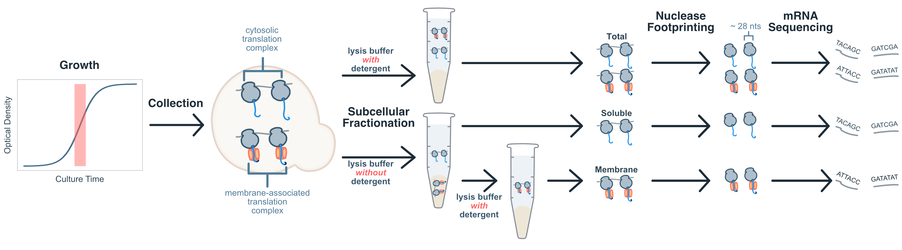{width=100%}
</div>

# Ribosome profiling

## 

<div class="centered">

{width=69%}

</div>

## 4: Dephosphorylation and polyadenylation {.columns-2 .font60}

<div style="float: left; width: 100%;" class="left">

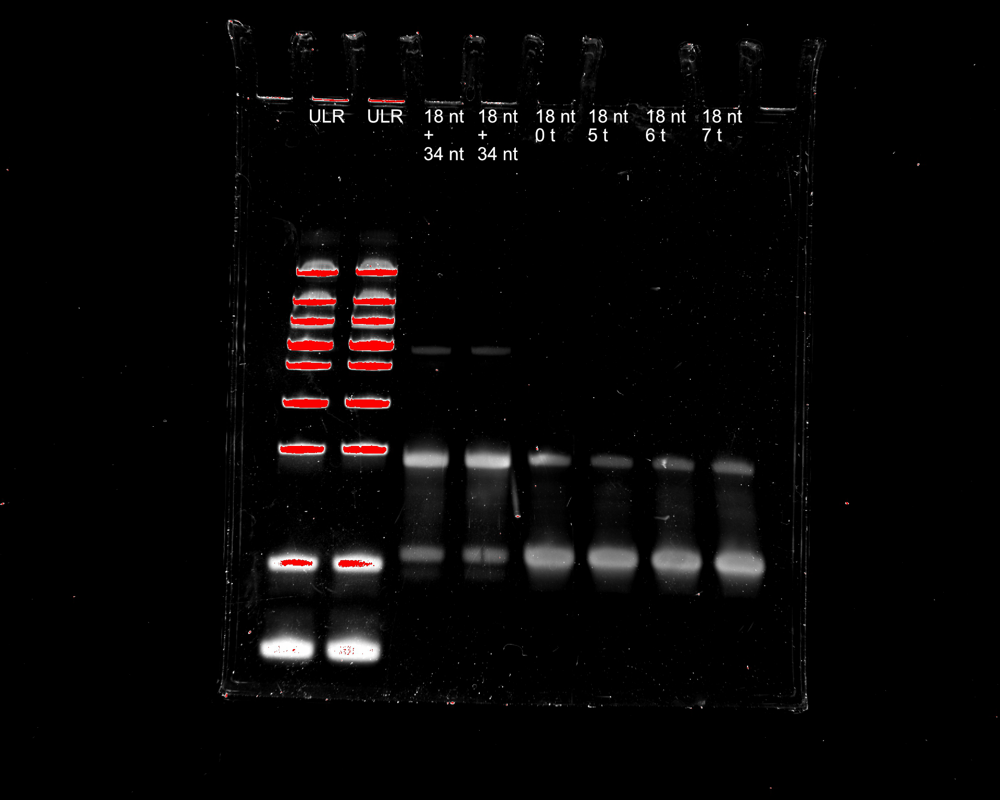{width=100%}

</div>

<div style="float: right; width: 100%;" class="left">

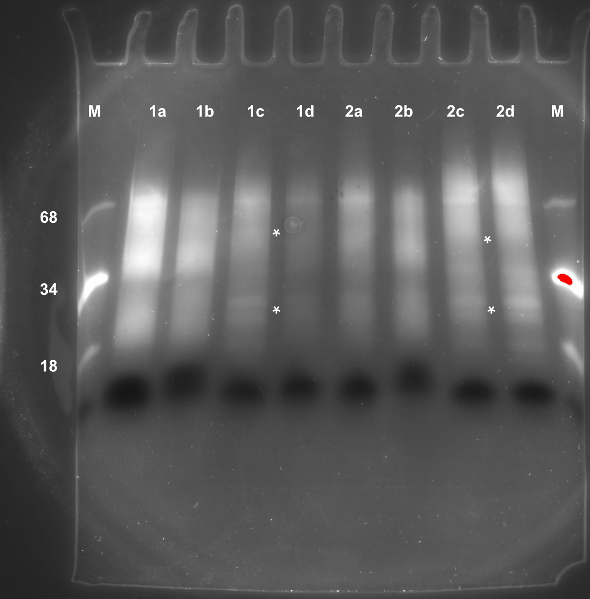{width=100%}
</div>


## 5: Reverse transcription with TSO {.columns-2 .font30}

<div style="float: left; width: 100%;" class="centered">


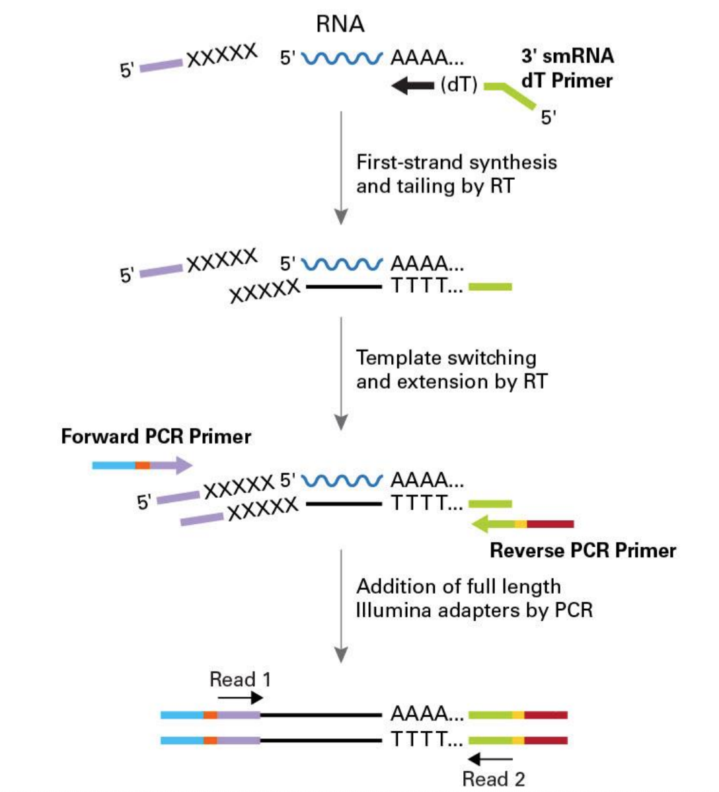{width=100%}

</div>

<div style="float: right; width: 100%;" class="centered">

{width=90%}

</div>


## 5: Inherent drawback: concatenation {.columns-2 .font30}

<div style="float: left; width: 100%;" class="centered">
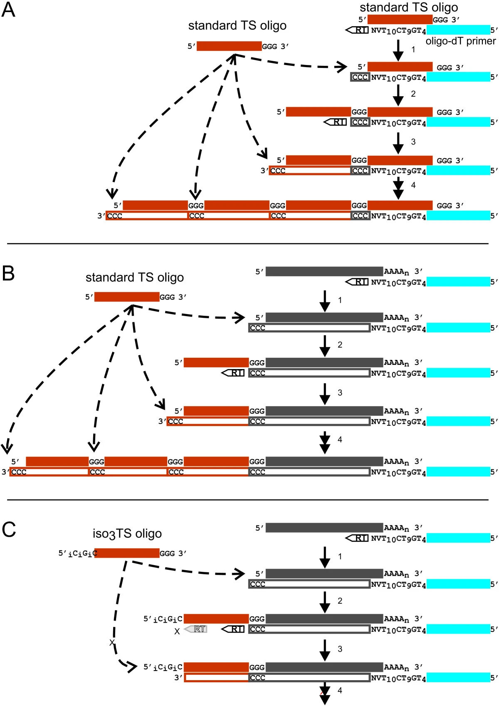{width=75%}

</div>

<div style="float: right; width: 100%;" class="centered">

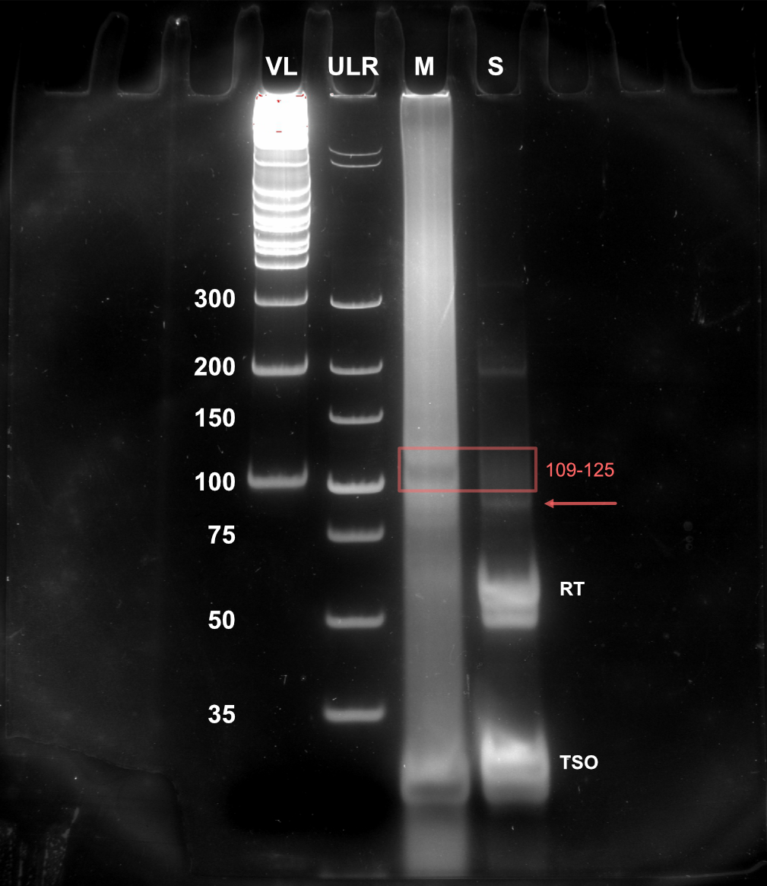{width=90%}
</div>


## 6: rRNA reduction with double stranded nuclease {.columns-2 .font30}

<div style="float: left; width: 100%;" class="centered">

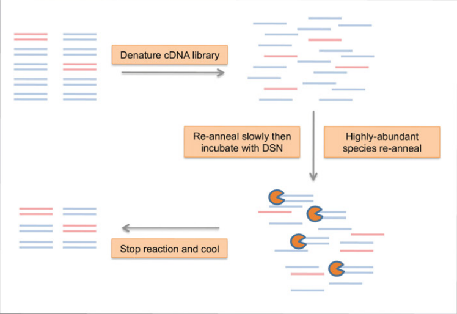{width=100%}

@Chung2015-bi

</div>

<div style="float: right; width: 100%;" class="centered">

{width=100%}

</div>


## 7: PCR Amplification {.columns-2 .font30}

<div style="float: left; width: 100%;" class="centered">

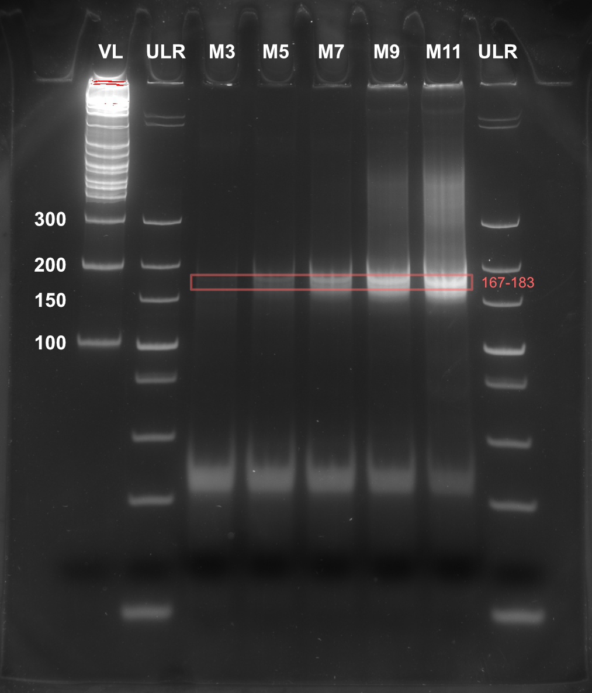{width=90%}

</div>

<div style="float: right; width: 100%;" class="centered">
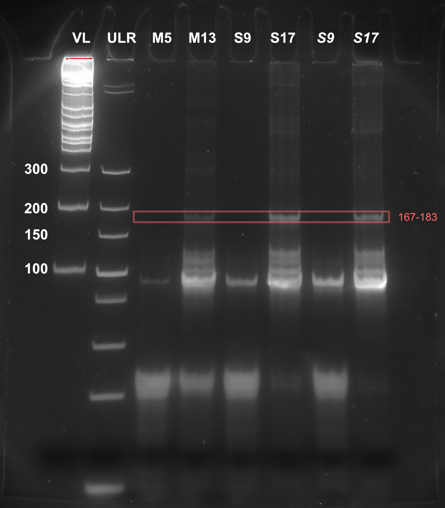{width=92%}
</div>


## 8: Next generation sequencing

<div align="center" style="vertical-align:middle">
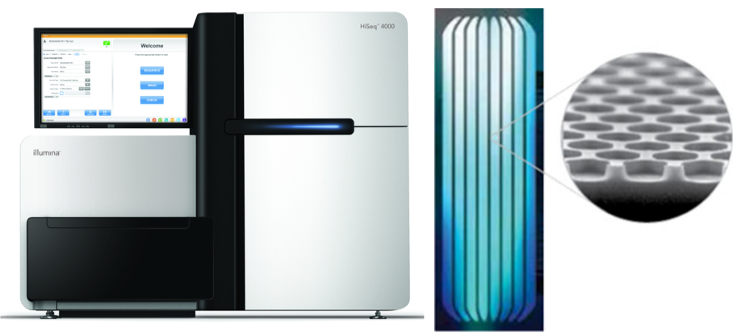{width=60%}
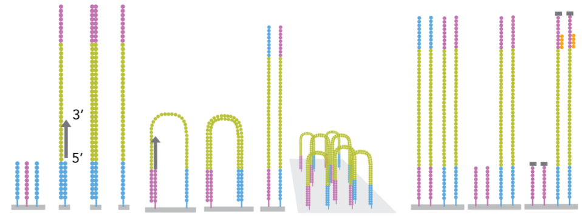{width=60%}
</div>


## References
