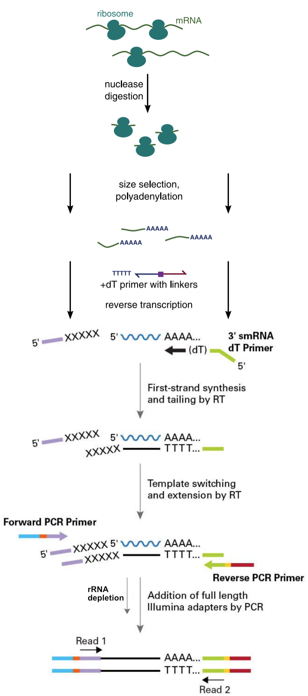
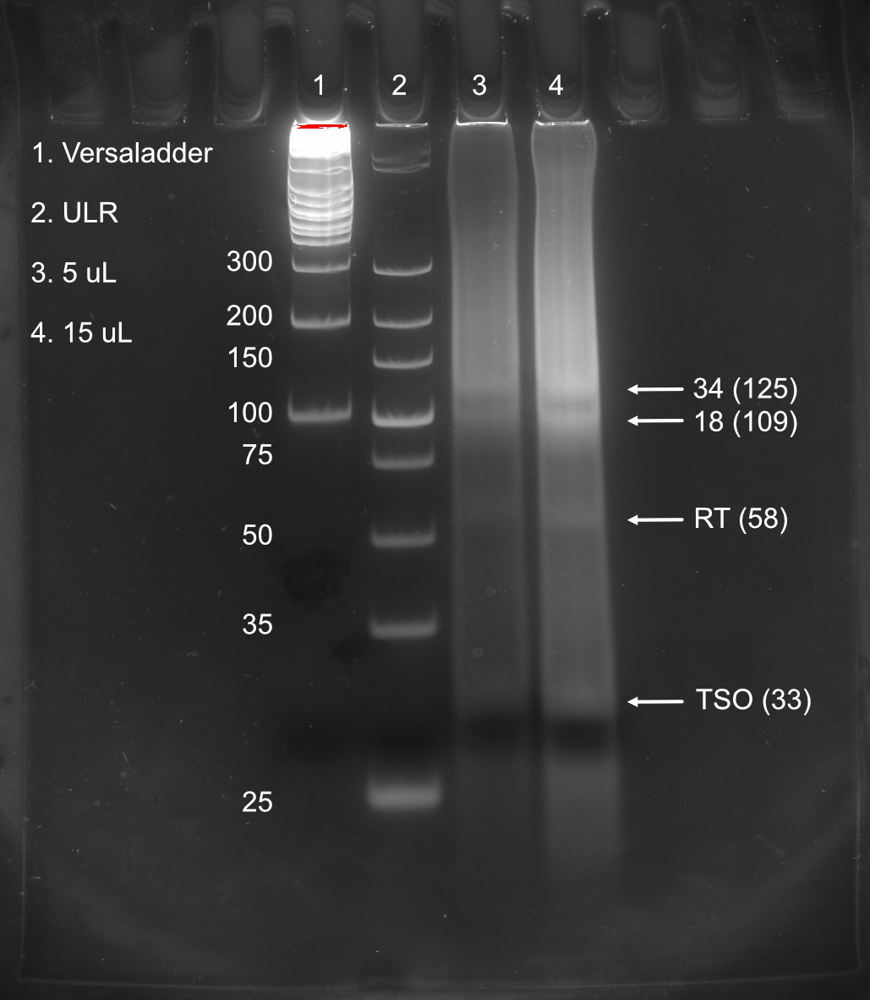

```{r options, message=FALSE, warning=FALSE, include=FALSE}

## Use cache for faster subsequent processing
knitr::opts_chunk$set(cache=TRUE)
opts <- options(knitr.kable.NA = "")

## Necessary libraries
library(data.table)
library(ggplot2)
library(cowplot)
library(magick)
library(scales)
library(plotly)
library(kableExtra)
library(dplyr)
library(zoo)

source("../processing/Revised/helperFunctions.R")

load("../data/pichia.dt.RData")
load("../data/yeast.dt.RData")

# Define colors
assign("black", "#000000", envir = .GlobalEnv)
assign("white", "#ffffff", envir = .GlobalEnv)
assign("grey", "#d3d6d9", envir = .GlobalEnv)
assign("orange", "#ff6666", envir = .GlobalEnv)
assign("blue", "#4a708b", envir = .GlobalEnv)
assign("lightblue1", "#809aad", envir = .GlobalEnv)
assign("lightblue2", "#a4b7c5", envir = .GlobalEnv)
assign("lightblue3", "#c8d4dc", envir = .GlobalEnv)
assign("lightblue4", "#ecf0f3", envir = .GlobalEnv)
assign("darkblue1", "#334e61", envir = .GlobalEnv)
assign("darkblue2", "#253845", envir = .GlobalEnv)
assign("darkblue3", "#162129", envir = .GlobalEnv)
assign("darkblue4", "#070b0d", envir = .GlobalEnv)

# Default theme
paper_theme <- theme_light(base_size = 10) + 
  theme(axis.text = element_text(size = rel(1.0), color = "black"),
        title = element_text(face = "bold"),
        axis.title = element_text(face = "bold"),
        plot.margin = margin(7,7,7,7), 
        panel.grid = element_blank())

# Wide tessellation theme
tess_top_theme <- theme_light(base_size = 10) + 
  theme(axis.text = element_text(size = rel(1.0), color = "black"),
        title = element_text(face = "bold"),
        axis.title = element_text(face = "bold"),
        plot.margin = margin(20,5,1,5),
        panel.grid = element_blank(), panel.border=element_blank())

# Narrow tessellation theme
tess_bottom_theme <- theme_light(base_size = 10) + 
  theme(axis.text = element_text(size = rel(1.0), color = "black"),
        title = element_text(face = "bold"),
        axis.title = element_text(face = "bold"),
        plot.margin = margin(1,5,20,5), 
        panel.grid = element_blank(), panel.border=element_blank())

# Enrichment vs TPM theme (top)
demands_top_theme <- paper_theme + theme(plot.margin = margin(7, 7, -5, 7),
                      axis.text.x = element_blank(),
                      panel.grid.major.x = element_line(size = rel(0.25), 
                                                        color = grey, 
                                                        linetype = "dashed"))
# Enrichment vs TPM theme (bottom)
demands_bottom_theme <- paper_theme + 
  theme(plot.margin = margin(0, 7, 7, 7), 
        panel.grid.major.x = element_line(size = rel(0.25),
                                          color = grey, 
                                          linetype = "dashed"))

# Min reads to plot
minimum <- 29

# Options for dot plot figures
dot.color = blue
contrast.color = orange
dot.size = 1
dot.shape = 20
line.size = 1

# Sets annotation size in plots to 6 font equivalent
annotation.size = 2.1166666666667

# knitr options
# 
knitr::knit_hooks$set(class = function(before, options, envir) {
  if(before){
    sprintf("<div class = '%s'>", options$class)
  }else{
    "</div>"
  }
})
```


## Ribosome profiling strategy {.columns-2 .font50}

<div style="float: left; width: 50%;" class="left">

<div class="centered">
{width=100%}
</div>

</div>

<div style="float: right; width: 150%;" class="left">

{width=100%}

{width=100%}

{width=100%}
</div>

## Reverse transcription with TSO works 

<div class="centered">
{width=45%}
</div>

## rRNA targeted DSN treatment works {.columns-2 .font50}

<div style="float: left; width: 100%;" class="centered">

{width=100%}

</div>

<div style="float: right; width: 100%;" class="centered">

.jpg){width=100%}

</div>

## Amplification works {.columns-2 .font50}

<div style="float: left; width: 100%;" class="centered">

{width=90%}

</div>

<div style="float: right; width: 100%;" class="centered">

{width=90%}

</div>


## Size discrepancy: Faulty bioanalyzer or complex formation? {.columns-2 .font50}
<div style="float: left; width: 100%;" class="centered">
{width=100%}
{width=100%}
</div>

<div style="float: right; width: 100%;" class="centered">
{width=60%}
</div>

## Previous strategy, time to move back? {.columns-2 .font50}

<div style="float: left; width: 70%;" class="left">

<div class="centered">
{width=100%}
</div>

</div>

<div style="float: right; width: 130%;" class="left">

{width=100%}

{width=100%}

{width=100%}
</div>


## Moving forward

1. Order reverse transcription primer from previous strategy (costs minimally and we can be sure that the library prep will work)

2. Sequence new strategy on MiSeq (I don't trust the BioAnalyzer)

  
<div display="flex" justify-content="center" class="centered">
{width=40%}
</div>