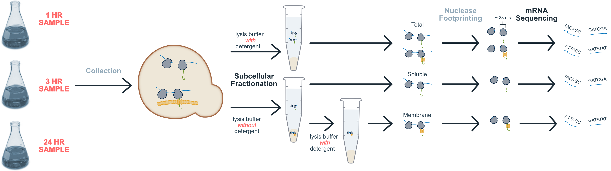

```{r options, message=FALSE, warning=FALSE, include=FALSE}

## Use cache for faster subsequent processing
knitr::opts_chunk$set(cache=TRUE)

## Necessary libraries
library(RiboProfiling)
library(data.table)
library(ggplot2)
library(cowplot)
library(magick)
library(grImport)
library(scales)
library(stats)
library(plotly)
library(plyr)
library(zoo)
library(dplyr)
library(tidyr)
library(knitr)
library(kableExtra)
library(DiagrammeR)
library(widgetframe)

source("../processing/Revised/riboProfiling.R")
source("../processing/Revised/helperFunctions.R")
source("../processing/Initial/avlayortFunctions.R")

# Necessary data sets
load("../data/pichia.dt.RData")
load("../data/yeast.dt.RData")
load("../data/yeast_2.dt.RData")
load("../data/m1.listPromoterCov.RData")
load("../data/m1.matchLenDistr.dt.RData")
load("../data/t.chx.rawCounts.RData")
load("../data/counts.dt.RData")
load("../data/homology.dt.RData")
load("../data/mask.dt.RData")
load("../data/hsa.dt.RData")

# Define colors
assign("black", "#000000", envir = .GlobalEnv)
assign("white", "#ffffff", envir = .GlobalEnv)
assign("grey", "#d3d6d9", envir = .GlobalEnv)
assign("orange", "#ff6666", envir = .GlobalEnv)
assign("blue", "#4a708b", envir = .GlobalEnv)
assign("lightblue1", "#809aad", envir = .GlobalEnv)
assign("lightblue2", "#a4b7c5", envir = .GlobalEnv)
assign("lightblue3", "#c8d4dc", envir = .GlobalEnv)
assign("lightblue4", "#ecf0f3", envir = .GlobalEnv)
assign("darkblue1", "#334e61", envir = .GlobalEnv)
assign("darkblue2", "#253845", envir = .GlobalEnv)
assign("darkblue3", "#162129", envir = .GlobalEnv)
assign("darkblue4", "#070b0d", envir = .GlobalEnv)

# Default theme
paper_theme <- theme_light(base_size = 10) + 
  theme(axis.text = element_text(size = rel(1.0), color = black),
        title = element_text(face = "bold"),
        axis.title = element_text(face = "bold"),
        plot.margin = margin(7,7,7,7), 
        panel.grid = element_blank())

# Wide tessellation theme
tess_top_theme <- theme_light(base_size = 10) + 
  theme(axis.text = element_text(size = rel(1.0), color = black),
        title = element_text(face = "bold"),
        axis.title = element_text(face = "bold"),
        plot.margin = margin(20,5,1,5),
        panel.grid = element_blank(), panel.border=element_blank())

# Narrow tessellation theme
tess_bottom_theme <- theme_light(base_size = 10) + 
  theme(axis.text = element_text(size = rel(1.0), color = black),
        title = element_text(face = "bold"),
        axis.title = element_text(face = "bold"),
        plot.margin = margin(1,5,20,5), 
        panel.grid = element_blank(), panel.border=element_blank())

# Enrichment vs TPM theme (top)
demands_top_theme <- paper_theme + theme(plot.margin = margin(7, 7, -5, 7),
                      axis.text.x = element_blank(),
                      panel.grid.major.x = element_line(size = rel(0.25), 
                                                        color = grey, 
                                                        linetype = "dashed"))
# Enrichment vs TPM theme (bottom)
demands_bottom_theme <- paper_theme + 
  theme(plot.margin = margin(0, 7, 7, 7), 
        panel.grid.major.x = element_line(size = rel(0.25),
                                          color = grey, 
                                          linetype = "dashed"))

# Min reads to plot
minimum <- 29

# Options for dot plot figures
dot.color = blue
contrast.color = orange
dot.size = 1
dot.shape = 20
line.size = 1

# Sets annotation size in plots to 6 font equivalent
annotation.size = 2.1166666666667

# Set NA values to blank on knitr tables
opts <- options(knitr.kable.NA = "")

```

```{r demandsMath, message=FALSE, warning=FALSE, include=FALSE}
cotrans <- pichia.dt %>% 
  filter(dl.loc != "Mitochondrion" & es.3 > 1) %>% 
  group_by(subcategory) %>% 
  summarise(genes = n(),
            ribosomes = sum(t.chx.rpm, na.rm = TRUE),
            chains = sum(t.chx.ctpm, na.rm = TRUE)) %>% 
  arrange(-chains)

cotrans.ids <- pichia.dt %>% filter(dl.loc != "Mitochondrion" & es.3 > 1) %>% 
  pull(id)

posttrans <- pichia.dt %>% 
  filter(dl.loc != "Mitochondrion" & es.3 < 1 & sp.sp == TRUE &
           !id %in% cotrans.ids) %>% 
  group_by(subcategory) %>% 
  summarise(genes = n(),
            chains = sum(t.chx.ctpm, na.rm = TRUE),
            ribosomes = sum(t.chx.rpm, na.rm = TRUE)) %>% 
  arrange(-chains) 

pp.er.mem <- pichia.dt[dl.loc != "Mitochondrion" & 
                         (tc.tmd >= 2 | (sp.sp == FALSE & tc.tmd ==1))]
pp.er.sec <- pichia.dt[dl.loc != "Mitochondrion" & sp.sp == TRUE & tc.tmd <= 1]

pp.mem.post.ctpm <- na.omit(pp.er.mem[es.3 < 1, t.chx.ctpm])
pp.sec.post.ctpm <- na.omit(pp.er.sec[es.3 < 1, t.chx.ctpm])
pp.er.post.ctpm <- sum(pp.mem.post.ctpm) + sum(pp.sec.post.ctpm)

pp.mem.co.ctpm <- na.omit(pp.er.mem[es.3 >= 1, t.chx.ctpm])
pp.sec.co.ctpm <- na.omit(pp.er.sec[es.3 >= 1, t.chx.ctpm])
pp.er.co.ctpm <- sum(pp.mem.co.ctpm) + sum(pp.sec.co.ctpm)

### - - - - - - - - - - - - - - - - - - - - - - - - - - - - - - - - - - - - - -
### A) Sacharomyces cerevisiae
### - - - - - - - - - - - - - - - - - - - - - - - - - - - - - - - - - - - - - -

# Establish cerevisiae data sets
demands.sc.dt <- yeast.dt[dl.loc != "Mitochondrion" & 
                               s.chx.scaledReads > minimum &
                               m.chx.scaledReads > minimum & 
                               t.chx.scaledReads > minimum, 
                             .(id, gene, description, t.chx.ctpm, t.chx.rpm,
                               es.chx.ms, sp.sp, tc.tm)]
sc.sec.dt <- demands.sc.dt[sp.sp == TRUE & tc.tm <= 1]
sc.mem.dt <- demands.sc.dt[tc.tm >= 2 | (sp.sp == FALSE & tc.tm ==1)]


### LEFT | Demand on translocatory system by numbers of nascent chains

# Establish NC data sets
sum.sc.secNC <- copy(sc.sec.dt)
setkey(sum.sc.secNC, es.chx.ms)
sum.sc.secNC[, sum := cumsum(t.chx.ctpm)]
sum.sc.secNC[, norm.sum := sum/max(sum) * 100]

sum.sc.memNC <- copy(sc.mem.dt)
setkey(sum.sc.memNC, es.chx.ms)
sum.sc.memNC[, sum := cumsum(t.chx.ctpm)]
sum.sc.memNC[, norm.sum := sum/max(sum) * 100]


# Establish RNC data sets
sum.sc.secRNC <- copy(sc.sec.dt)
setkey(sum.sc.secRNC, es.chx.ms)
sum.sc.secRNC[, sum := cumsum(t.chx.rpm)]
sum.sc.secRNC[, norm.sum := sum/max(sum) * 100]

sum.sc.memRNC <- copy(sc.mem.dt)
setkey(sum.sc.memRNC, es.chx.ms)
sum.sc.memRNC[, sum := cumsum(t.chx.rpm)]
sum.sc.memRNC[, norm.sum := sum/max(sum) * 100]


# Establish pichia data set
demands.pp.dt <- pichia.dt[dl.loc != "Mitochondrion" & 
                               s.chx.scaledReads > minimum &
                               m.chx.scaledReads > minimum & 
                               t.chx.scaledReads > minimum, 
                             .(id, gene, description, t.chx.ctpm, t.chx.rpm,
                               es.3, sp.sp, tc.tmd)]
pp.sec.dt <- demands.pp.dt[sp.sp == TRUE & tc.tmd <= 1]
pp.mem.dt <- demands.pp.dt[tc.tmd >= 2 | (sp.sp == FALSE & tc.tmd ==1)]

### LEFT | Demand on translocatory system by numbers of nascent chains

# Establish NC data sets
sum.pp.secNC <- copy(pp.sec.dt)
setkey(sum.pp.secNC, es.3)
sum.pp.secNC[, sum := cumsum(t.chx.ctpm)]
sum.pp.secNC[, norm.sum := sum/max(sum) * 100]

sum.pp.memNC <- copy(pp.mem.dt)
setkey(sum.pp.memNC, es.3)
sum.pp.memNC[, sum := cumsum(t.chx.ctpm)]
sum.pp.memNC[, norm.sum := sum/max(sum) * 100]


# Establish RNC data sets
sum.pp.secRNC <- copy(pp.sec.dt)
setkey(sum.pp.secRNC, es.3)
sum.pp.secRNC[, sum := cumsum(t.chx.rpm)]
sum.pp.secRNC[, norm.sum := sum/max(sum) * 100]

sum.pp.memRNC <- copy(pp.mem.dt)
setkey(sum.pp.memRNC, es.3)
sum.pp.memRNC[, sum := cumsum(t.chx.rpm)]
sum.pp.memRNC[, norm.sum := sum/max(sum) * 100]

spDif <- pichia.dt %>% 
  filter(dl.loc != "Mitochondrion" & sp.sp == TRUE & tc.tmd <= 1) %>% 
  select(id, gene, description, protein.l, t.chx.ctpm, es.3)
```

## Challenges limit bioproduction {.font50}

<div class="centered">
{width=90%}
</div>

## Secretion challenges: ER Trafficking {.font50}

{width=100%} 

## Using data science for rational bioproduction {.font50}

<div class="centered">
{width=83%}
</div>

## Quantifying demands {.font50}

{width=100%}

## Ribo-Seq methods for quantification {.columns-2 .font50}

<div style="float: left; width: 70%;" class="centered">
{width=70%}
</div>

<div style="float: right; width: 130%;" class="centered">
{width=90%}
</div>

## Distinguishing translation events on the ER

<div class="centered">
{width=90%}
</div>

```{r enrichment, echo=FALSE, message=FALSE, warning=FALSE, fig.align="left", fig.pos="ht", fig.width=10, fig.height=3}

pppp.dt <- pichia.dt[s1.scaledReads > 30 & m1.scaledReads > 30 &
                       s3.scaledReads > 30 & m3.scaledReads > 30]
inf_na(pppp.dt)
na_zero(pppp.dt)

scpp.dt <- merge(pichia.dt[gene %in% yeast.dt$gene &
                             s3.scaledReads > 30 &
                             m3.scaledReads > 30, 
                           .(S288C.gene, GS115.es.3 = es.3)], 
                 yeast.dt[gene %in% pichia.dt$gene &
                             s.chx.scaledReads > 30 &
                             m.chx.scaledReads > 30, 
                          .(S288C.gene = gene, S288C.es.chx.ms = es.chx.ms)], 
                 by.x = 'S288C.gene', by.y = 'S288C.gene')
inf_na(scpp.dt)
na_zero(scpp.dt)

if (min(pppp.dt$es.1) < min(scpp.dt$GS115.es.3)) {x0 <- min(pppp.dt$es.1)} else {x0 <- min(scpp.dt$GS115.es.3)}
if (max(pppp.dt$es.1) > max(scpp.dt$GS115.es.3)) {xf <- max(pppp.dt$es.1)} else {xf <- max(scpp.dt$GS115.es.3)}
if (min(pppp.dt$es.3) < min(scpp.dt$S288C.es.chx.ms)) {y0 <- min(pppp.dt$es.3)} else {x0 <- min(scpp.dt$S288C.es.chx.ms)}
if (max(pppp.dt$es.1) > max(scpp.dt$S288C.es.chx.ms)) {yf <- max(pppp.dt$es.1)} else {xf <- max(scpp.dt$S288C.es.chx.ms)}


scatter.pppp <- ggplot(data = pppp.dt,
                       aes(x = es.1, y = es.3)) +
  geom_point(color = blue,
             size = 1,
             shape = 20,
             na.rm = TRUE) +
  labs(title = "Enrichment is conserved",
       x = expression(bold(paste(bolditalic("K. phaffii"), " 1 enrichment"))),
       y = expression(bold(paste(bolditalic("K. phaffii"), " 2 enrichment")))) +
  annotate("text",
           x = x0 + (xf - x0)/10,
           y = max(yf),
           label = paste0(
             "Pearson's r = ", round(cor.test(
               pppp.dt$es.1, pppp.dt$es.3, method = "pearson")$estimate, 2)),
           size = 3.527778) +
  scale_x_continuous(limits = c(x0, xf)) +
  scale_y_continuous(limits = c(y0, yf)) +
  paper_theme
 
memVsol.dt <- pichia.dt[m.chx.scaledReads > minimum & 
                            s.chx.scaledReads > minimum, 
                          .(id, gene, membrane=m.chx.ctpm, soluble=s.chx.ctpm, enrichment=es.chx.ms)]

if (max(log(memVsol.dt$soluble)) > max(log(memVsol.dt$membrane))) {
  bigVal <- max(log(memVsol.dt$soluble))
} else {bigVal <- max(log(memVsol.dt$membrane))}
if (min(log(memVsol.dt$soluble)) < min(log(memVsol.dt$membrane))) {
  smallVal <- min(log(memVsol.dt$soluble))
} else {smallVal <- min(log(memVsol.dt$membrane))}

scatter.memVsol <- ggplot(data = memVsol.dt) +
  geom_point(aes(x = log(soluble), y = log(membrane), text1=enrichment),
             color = dot.color, 
             size = 0.7, 
             shape = dot.shape,
             na.rm = TRUE) +
  labs(x = "Soluble log expression",
       y = "Membrane log expression", 
       title = "Expression on membrane and cytosol") +
    geom_abline(slope = 1, 
              intercept = 1, 
              size = 2,
              alpha = 0.25, 
              color = contrast.color) +
  scale_x_continuous(limits = c(smallVal, bigVal)) +
  scale_y_continuous(limits = c(smallVal, bigVal)) +
  paper_theme

 plot_grid(scatter.memVsol, scatter.pppp, 
           ncol = 1, align = 'hv')
```

## Demands in Komagataella phaffii

```{r nascentDemands, echo=FALSE, message=FALSE, warning=FALSE, fig.width=10}
# This figure plots enrichment score against TPM. It is meant to indicate how
# many nascent chains will be entering endoplasmic reticulum. Visually, it shows
# that posttranslational targeting imposes a huge demand, but is restricted to
# only a handful of proteins.

# Specify colors for secreted and membrane proteins
col.sec <- contrast.color
col.mem <- dot.color

# Get name of top genes for K. phaffii nascent chains
pp.mem.ctpm.gene <- pp.mem.dt %>%
  arrange(-t.chx.ctpm) %>% pull(gene) %>% head(1)

pp.sec.ctpm.gene <- pp.sec.dt %>%
  arrange(-t.chx.ctpm) %>% pull(gene) %>% head(1)

pp.mem.rpm.gene <- pp.mem.dt %>%
  arrange(-t.chx.rpm) %>% pull(gene) %>% head(1)

pp.sec.rpm.gene <- pp.sec.dt %>%
  arrange(-t.chx.rpm) %>% pull(gene) %>% head(1)

pp.sec.ctpm.es.gene <- pp.sec.dt %>% 
  filter(es.3 > 3) %>% arrange(-t.chx.ctpm) %>% pull(gene) %>% head(1)

pp.sec.rpm.es.gene <- pp.sec.dt %>% 
  filter(es.3 > 3) %>% arrange(-t.chx.rpm) %>% pull(gene) %>% head(1)

# Top scatter plot for NC
scatter.ppNC <- ggplot() +
  geom_point(data = pp.mem.dt,
             aes(x = es.3, y = t.chx.ctpm),
             size = dot.size, color = col.mem,
             na.rm = TRUE) +
  geom_segment(data = pp.mem.dt,
               aes(x = es.3, y = t.chx.ctpm, xend = es.3, yend = 0),
               size = dot.size, color = col.mem,
               na.rm = TRUE) +
  annotate("text",
           x = pp.mem.dt[gene == pp.mem.ctpm.gene, es.3] + .4,
           y = pp.mem.dt[gene == pp.mem.ctpm.gene, t.chx.ctpm] + 600,
           label = pp.mem.ctpm.gene,
           color = col.mem,
           size = annotation.size) +
  geom_point(data = pp.sec.dt,
             aes(x = es.3, y = t.chx.ctpm),
             size = dot.size, color = col.sec,
             na.rm = TRUE) +
  geom_segment(data = pp.sec.dt,
               aes(x = es.3, y = t.chx.ctpm, xend = es.3, yend = 0),
               size = dot.size, color = col.sec,
               na.rm = TRUE) +
  annotate("text",
           x = pp.sec.dt[gene == pp.sec.ctpm.gene, es.3] + 0.8,
           y = pp.sec.dt[gene == pp.sec.ctpm.gene, t.chx.ctpm],
           label = pp.sec.ctpm.gene,
           color = col.sec,
           size = annotation.size) +
  annotate("text",
           x = pp.sec.dt[gene == pp.sec.ctpm.es.gene, es.3] - .4,
           y = pp.sec.dt[gene == pp.sec.ctpm.es.gene, t.chx.ctpm] + 600,
           label = pp.sec.ctpm.es.gene,
           color = col.sec,
           size = annotation.size) +
  labs(title = expression(bold(paste(
    "Nascent chain demands"))),
       x = "", y = "cTPM") +
  scale_y_continuous(label = scientific_format()) +
  demands_top_theme

# Sum line plot for NC
line.ppNC <- ggplot() +
  geom_line(data = sum.pp.memNC,
            aes(x = es.3, y = norm.sum),
            col = col.mem, size = line.size, na.rm = TRUE) +
  geom_line(data = sum.pp.secNC,
            aes(x = es.3, y = norm.sum),
            color = col.sec, size = line.size, na.rm = TRUE) +
  labs(x = "Enrichment score",
       y = "cum.%") +
  scale_x_continuous(breaks = c(0, 2, 4)) +
  demands_bottom_theme

# Put NC together
pp.nc <- plot_grid(scatter.ppNC, line.ppNC,
                   rel_heights = c(1.8, 1),
                   nrow = 2,
                   align = 'v',
                   labels = c("", ""),
                   label_size = 10)

# Get name of top genes for K. phaffii ribosomes
pp.mem.ctpm.gene <- pp.mem.dt %>%
  arrange(-t.chx.ctpm) %>% pull(gene) %>% head(1)

pp.sec.ctpm.gene <- pp.sec.dt %>%
  arrange(-t.chx.ctpm) %>% pull(gene) %>% head(1)

pp.mem.rpm.gene <- pp.mem.dt %>%
  arrange(-t.chx.rpm) %>% pull(gene) %>% head(1)

pp.sec.rpm.gene <- pp.sec.dt %>%
  arrange(-t.chx.rpm) %>% pull(gene) %>% head(1)

pp.sec.ctpm.es.gene <- pp.sec.dt %>% 
  filter(es.3 > 3) %>% arrange(-t.chx.ctpm) %>% pull(gene) %>% head(1)

pp.sec.rpm.es.gene <- pp.sec.dt %>% 
  filter(es.3 > 3) %>% arrange(-t.chx.rpm) %>% pull(gene) %>% head(1)

# Top scatter plot for RNC
scatter.ppRNC <- ggplot() +
  geom_point(data = pp.mem.dt,
             aes(x = es.3, y = t.chx.rpm),
             size = dot.size, color = col.mem, na.rm = TRUE) +
  geom_segment(data = pp.mem.dt,
               aes(x = es.3, y = t.chx.rpm,
                   xend = es.3, yend = 0),
               size = dot.size, color = col.mem, na.rm = TRUE) +
  annotate("text",
           x = pp.mem.dt[gene == pp.mem.rpm.gene, es.3] + .4,
           y = pp.mem.dt[gene == pp.mem.rpm.gene, t.chx.rpm] + 250,
           label = pp.mem.rpm.gene,
           color = col.mem,
           size = annotation.size) +
  geom_point(data = pp.sec.dt,
             aes(x = es.3, y = t.chx.rpm),
             size = dot.size, color = col.sec, na.rm = TRUE) +
  geom_segment(data = pp.sec.dt,
               aes(x = es.3, y = t.chx.rpm,
                   xend = es.3, yend = 0),
               size = dot.size, color = col.sec, na.rm = TRUE) +
  annotate("text",
           x = pp.sec.dt[gene == pp.sec.rpm.gene, es.3] + .4,
           y = pp.sec.dt[gene == pp.sec.rpm.gene, t.chx.rpm],
           label = pp.sec.rpm.gene,
           color = col.sec,
           size = annotation.size) +
  annotate("text",
           x = pp.sec.dt[gene == pp.sec.rpm.es.gene, es.3] - .5,
           y = pp.sec.dt[gene == pp.sec.rpm.es.gene, t.chx.rpm],
           label = pp.sec.rpm.es.gene,
           color = col.sec,
           size = annotation.size) +
  labs(title = expression(bold(paste(
    "Ribosome demands"))),
       x = "", y = "cRPM") +
  scale_y_continuous(label = scientific_format()) +
  demands_top_theme

# Sum line plot for RNC
line.ppRNC <- ggplot() +
  geom_line(data = sum.pp.memRNC,
            aes(x = es.3, y = norm.sum),
            col = col.mem, size = line.size, na.rm = TRUE) +
  geom_line(data = sum.pp.secRNC,
            aes(x = es.3, y = norm.sum),
            color = col.sec, size = line.size, na.rm = TRUE) +
  labs(x = "Enrichment score",
       y = "cum.%") +
  scale_x_continuous(breaks = c(0, 2, 4)) +
  demands_bottom_theme

# Put RNC together
pp.rnc <- plot_grid(scatter.ppRNC, line.ppRNC,
                   rel_heights = c(1.8, 1),
                   nrow = 2,
                   align = 'v')

demands <- plot_grid(pp.nc, pp.rnc,
                     align='v',
                     ncol =2)

demands
```

## Gene targets for enchanced expression {.columns-2}

<div style="float: left; width: 100%;" class="centered">
```{r kpCoTargets, echo=FALSE, message=FALSE, warning=FALSE}
library(kableExtra)

pichia.dt[, CBS7435.pichiaGenome.product := sapply(CBS7435.pichiaGenome.product, function(x) unlist(strsplit(x, ";"))[[1]])]

list.size <- 5

# Nascent chains

kpTarg <- pichia.dt[dl.loc != "Mitochondrion" & es.chx.ms > 4 & !is.na(t.chx.ctpm)]
setkey(kpTarg, t.chx.ctpm)
setorderv(kpTarg, key(kpTarg), order = -1)

names <- kpTarg$gene[1:list.size]
cTPM <- as.character(round(kpTarg$t.chx.ctpm[1:list.size]))
location <- kpTarg$dl.loc[1:list.size]
length <- as.character(kpTarg$protein.l[1:list.size])
product <- kpTarg$CBS7435.pichiaGenome.product[1:list.size]

table <- data.frame(
  Gene = names, cTPM = cTPM, Length = length, Description = product)

knitr::kable(
  table, booktabs = TRUE,
  caption = 'Cotranslationally Targeted Proteins',
) %>% 
  kable_styling(bootstrap_options = "striped", font_size = 16)

# Ribosomes

kpTarg <- pichia.dt[dl.loc != "Mitochondrion" & es.chx.ms > 4 & !is.na(t.chx.rpm)]
setkey(kpTarg, t.chx.rpm)
setorderv(kpTarg, key(kpTarg), order = -1)

names <- kpTarg$gene[1:list.size]
cRPM <- as.character(round(kpTarg$t.chx.rpm[1:list.size]))
location <- kpTarg$dl.loc[1:list.size]
length <- as.character(kpTarg$protein.l[1:list.size])
product <- kpTarg$CBS7435.pichiaGenome.product[1:list.size]

table <- data.frame(
  Gene = names, cRPM = cRPM, Length = length, Description = product)

knitr::kable(
  table, booktabs = TRUE,
) %>% 
  kable_styling(bootstrap_options = "striped", font_size = 16)
```
</div>

<div style="float: right; width: 100%;" class="centered">
```{r kpPostTargets, echo=FALSE, message=FALSE, warning=FALSE}

list.size <- 5

# TPM

kpPostTarg <- pichia.dt[dl.loc != "Mitochondrion" & es.chx.ms < 1 & !is.na(t.chx.ctpm) & sp.sp == TRUE & tc.tmd <= 1]
setkey(kpPostTarg, t.chx.ctpm)
setorderv(kpPostTarg, key(kpPostTarg), order = -1)

names <- kpPostTarg$gene[1:list.size]
cTPM <- as.character(round(kpPostTarg$t.chx.ctpm[1:list.size]))
location <- kpPostTarg$dl.loc[1:list.size]
length <- as.character(kpPostTarg$protein.l[1:list.size])
product <- kpPostTarg$CBS7435.pichiaGenome.product[1:list.size]

table <- data.frame(
  Gene = names, cTPM = cTPM, Length = length, Description = product)

knitr::kable(
  table, booktabs = TRUE, format = "html",
  caption = 'Posttranslationally Targeted Proteins',
) %>% kableExtra::kable_styling(bootstrap_options = "striped", font_size = 16)

# RPM

kpPostTarg <- pichia.dt[dl.loc != "Mitochondrion" & es.chx.ms < 1 & !is.na(t.chx.rpm) & sp.sp == TRUE & tc.tmd <= 1]
setkey(kpPostTarg, t.chx.rpm)
setorderv(kpPostTarg, key(kpPostTarg), order = -1)

names <- kpPostTarg$gene[1:list.size]
cRPM <- as.character(round(kpPostTarg$t.chx.rpm[1:list.size]))
location <- kpPostTarg$dl.loc[1:list.size]
length <- as.character(kpPostTarg$protein.l[1:list.size])
product <- kpPostTarg$CBS7435.pichiaGenome.product[1:list.size]

table <- data.frame(
  Gene = names, cRPM = cRPM, Length = length, Description = product)

knitr::kable(
  table, booktabs = TRUE, format = "html",
) %>% kableExtra::kable_styling(bootstrap_options = "striped", font_size = 16)
```
</div>


## PMA1 {.columns-2 .smaller}

<div style="float: left; width: 130%;">
**Description**  
*PMA1* is a plasma membrane H\textsuperscript{+} ATPase that acts as the primary regulator of cytoplasmic pH.

+ Essential gene

+ Long lived

<div class="centered">
{width=100%}
</div>

</div>

<div style="float: right; width: 70%;">

***Demands***  
+ Represents `r percent(pichia.dt[gene == "PMA1", t.chx.ctpm]/sum(pichia.dt[es.3 >= 1 & dl.loc == "Cell membrane", t.chx.ctpm], na.rm = TRUE))` of nascent chains entering ER cotranslationally

<div class="centered">
{width=80%}
</div>
</div>


## SPI1 {.columns-2 .smaller}

<div style="float: left; width: 130%;">
**Description**  
*SPI1* is a GPI-anchored cell wall protein involved in weak acid resistance

+ Non-essential gene

+ Weakened chemical and acid pH resistance

<div class="centered">
{width=90%}
</div>

</div>

<div style="float: right; width: 70%;">

***Demands***  

+ Represents `r percent(pichia.dt[gene == "SPI1", t.chx.ctpm]/sum(pichia.dt[es.3 < 1 & sp.sp == TRUE & tc.tmd <= 1, t.chx.ctpm], na.rm = TRUE))` of nascent chains entering ER posttranslationally

<div class="centered">
{width=100%}
</div>
</div>

## Testing under heterologous conditions {.columns-2}

<div style="float: left; width: 70%;" class="centered">
{width=100%}
</div>

<div style="float: right; width: 130%;" class="centered">
{width=100%}
{width=100%}
</div>

## Changes in demands (skepticle) {.columns-2}

<div style="float: left; width: 100%;" class="centered">
```{r hsaCoTargets, echo=FALSE, message=FALSE, warning=FALSE}

hsa.dt[, description := sapply(description, function(x) unlist(strsplit(x, ";"))[[1]])]

list.size <- 15

kpTarg <- hsa.dt[dl.loc != "Mitochondrion" & es.ts.0 > 1 & !is.na(diff.tpm)]
setkey(kpTarg, diff.tpm)
setorderv(kpTarg, key(kpTarg), order = -1)

names <- kpTarg$gene[1:list.size]
PreTPM <- as.character(round(kpTarg$tot.0.tpm[1:list.size]))
PostTPM <- as.character(round(kpTarg$tot.24.tpm[1:list.size]))
description <- kpTarg$description[1:list.size]

table <- data.frame(
  Gene = names, Before = PreTPM, After = PostTPM, Description = description)

knitr::kable(
  table, booktabs = TRUE,
  caption = 'Highest Differences in Expression for Cotranslationally Targeted Proteins',
) %>% 
  kable_styling(bootstrap_options = "striped", font_size = 16) %>%
  scroll_box(width = "100%", height = "400px")
```
</div>

<div style="float: right; width: 100%;" class="centered">
```{r hsaPostTargets, echo=FALSE, message=FALSE, warning=FALSE}

list.size <- 15

kpPostTarg <- hsa.dt[dl.loc != "Mitochondrion" & es.ts.0 < 1 & tc.tmd <=1 & sp.sp == TRUE & !is.na(diff.tpm)]
setkey(kpPostTarg, diff.tpm)
setorderv(kpPostTarg, key(kpPostTarg), order = -1)

names <- kpPostTarg$gene[1:list.size]
PreTPM <- as.character(round(kpPostTarg$tot.0.tpm[1:list.size]))
PostTPM <- as.character(round(kpPostTarg$tot.24.tpm[1:list.size]))
description <- kpPostTarg$description[1:list.size]

table <- data.frame(
  Gene = names, Before = PreTPM, After = PostTPM, Description = description)

knitr::kable(
  table, booktabs = TRUE,
  caption = 'Highest Differences in Expression for Postranslationally Targeted Proteins',
) %>% 
  kable_styling(bootstrap_options = "striped", font_size = 16) %>%
  scroll_box(width = "100%", height = "400px")
```
</div>

#
{width=100%}